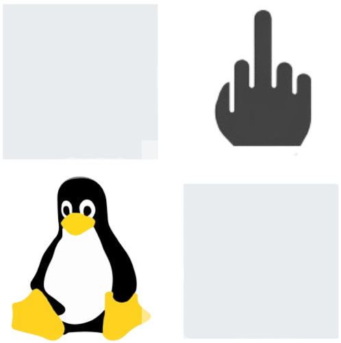

<p align="center">
  
</p>

<p align="center"><strong>Go Fix Your Microsoft Surface.</strong></p>

GFYMS is an Arch-based Linux project built specifically around the Microsoft Surface Pro 7. It started as a rage project: take a Surface that is unnecessarily annoying under Linux, reverse-engineer what is missing, and build the native Linux pieces needed to make the hardware actually usable.

GFYMS is independent and is not affiliated with Microsoft.

## What this is

GFYMS aims to be more than a driver collection. It is a complete Surface-specific Arch Linux enablement stack with a KDE Plasma desktop integration layer, reproducible builds, diagnostics, and hardware qualification.

```text
Surface Pro 7 hardware
        |
        v
Linux kernel / native drivers
        |
        v
GFYMS Surface integration
        |
        +--> hardware detection
        +--> Surface policy / quirks
        +--> diagnostics
        +--> D-Bus API
        |
        v
KDE Plasma
        |
        +--> GFYMS Surface System Settings
        +--> Plasma status / controls
        +--> Power / Battery
        +--> Touch / Pen
        +--> Type Cover
        +--> Camera / Hello
        +--> Sensors / Rotation
        +--> Firmware
```

### KDE Plasma is a first-class target

GFYMS does **not** try to make KDE load Windows `.sys` drivers. The Linux kernel remains responsible for actual hardware drivers. GFYMS adds the Surface-specific glue that Plasma can understand through Linux interfaces, D-Bus, udev, sysfs, input, IIO, power-supply, ALSA/PipeWire, libcamera and related native interfaces.

The planned `gfyms-kde-surface` package provides a dedicated **GFYMS Surface** KDE System Settings module plus Plasma integration. KDE documents KCMs and QML-based System Settings modules in its KCM development guide: https://develop.kde.org/docs/features/configuration/kcm/.

Arch packages Plasma through `plasma-meta`, with the normal KDE System Settings and desktop components available from the Arch repositories. GFYMS layers its Surface-specific controls on top of that native Linux desktop stack. See https://archlinux.org/packages/extra/any/plasma-meta/.

## Surface Pro 7 support target

- IPTS touchscreen and palm-rejection tuning
- Surface Pen pressure, buttons, hover and firmware awareness
- detachable Type Cover, touchpad and keyboard backlight
- Intel IPU4/IPU4P camera support
- front OV5693, rear OV8865 and IR OV7251
- Intel SST / SoundWire / Realtek audio
- Wi-Fi and Bluetooth
- battery, charging, thermal and power-management integration
- accelerometer, ambient-light sensing and automatic rotation
- USB-C, DisplayPort, MST and dock/USB4/Thunderbolt behavior
- TPM and firmware inventory/update integration
- optional fingerprint support where Linux hardware support exists
- **GFYMS Hello** for a native Linux Windows-Hello-style IR face-authentication experience
- guarded Windows `.EXE` compatibility/extraction tooling
- Surface-specific diagnostics and hardware-in-the-loop testing
- **GFYMS Center** for Surface controls, updates, release notes, rollback and GitHub feedback
- **GFYMS Find My Bridge** for an optional OpenHaystack-compatible Linux BLE beacon
- **GFYMS 24px visual system** across GFYMS apps and the Plasma shell

See `docs/GFYMS-HARDWARE-CONTRACT.md` for the acceptance contract.

## GFYMS Center

The native GFYMS Center is the user-facing control plane for the operating system.

It includes:

- Surface Pen controls modeled after the Surface app experience
- GitHub release discovery with full release notes
- selected-release installation so a troublesome release can be downgraded
- SHA-256 verification against the release checksum asset
- package-scoped rollback
- GitHub Discussions access with one-click diagnostic report copy
- Find My beacon controls

See `docs/GFYMS-CENTER.md`.

## Find My

GFYMS uses an optional OpenHaystack-compatible Linux HCI beacon path. That makes the Surface capable of transmitting a Find My research beacon that nearby Apple devices may relay.

This is explicitly not represented as Apple-certified Find My registration.

See `docs/GFYMS-FIND-MY.md`.

## 24px visual language

GFYMS Center uses a 24px radius system. The same visual language will be applied to the GFYMS Plasma shell and window-decorations layer.

KDE provides Plasma Style and KWin window-decoration extension points for this work, but arbitrary third-party applications cannot be forced to adopt the radius.


## GFYMS Hello

The Surface Pro 7 exposes a dedicated camera path used for Windows Hello facial recognition. GFYMS's implementation is deliberately **not** Microsoft's Windows Hello software.

Instead, the target is:

```text
OV7251 IR camera
      -> IPU4/IPU4P
      -> libcamera
      -> GFYMS Hello
      -> local face authentication
      -> PAM
      -> KDE / login / sudo / polkit
```

Biometric data stays local, password recovery remains available, and recognition backends stay replaceable.

See `docs/GFYMS-HELLO.md`.

## Reverse-engineering corpus

The `extracted/` tree is the research and provenance corpus produced from the Surface Pro 7 Windows MSI. It is useful for identifying hardware IDs, ACPI IDs, firmware relationships, configuration clues, package structure and vendor behavior.

It is **not automatically a redistributable software bundle**.

GFYMS's distribution boundary is documented in `docs/LEGAL-AND-DISTRIBUTION.md`. Owning the physical Surface does not by itself transfer Microsoft's copyright or give the public a license to redistribute its Windows drivers, DLLs, EXEs or firmware.

The project therefore follows this model:

```text
vendor package
    |
    +--> hardware IDs / protocol clues / provenance
    |
    v
native GFYMS Linux implementation
    |
    +--> legal third-party firmware when applicable
    +--> user-supplied vendor files where required
    +--> no Windows kernel driver loading
```

## Manual Arch patcher

Already running Arch Linux or an Arch-based distribution on a Surface Pro 7?

GFYMS will provide a manual patcher that updates the existing installation without requiring the complete GFYMS ISO.

```text
existing Arch
   -> detect Surface Pro 7
   -> snapshot boot/kernel/config
   -> install/update GFYMS packages
   -> configure KDE integration
   -> enable required services
   -> run gfyms doctor
   -> generate report + rollback information
```

The patcher is intended to consume the same signed GFYMS package artifacts used to build the official ISO.

See `docs/GFYMS-USER-PATCHER.md`.

## Downloads / release artifacts

**Current status:** the official GFYMS ISO, Arch patcher release bundle, and USB Tool binaries are **not built yet**. The repository currently contains the architecture, profiles and release specifications; publishing a finished artifact before the native packages and hardware qualification exist would be misleading.

When a release is ready, the three user-facing downloads will be published together:

- **GFYMS Arch Surface Patcher** — update an existing Arch/Arch-based Surface Pro 7 installation.
- **GFYMS Surface Pro 7 ISO** — the complete Arch + KDE Plasma GFYMS installation image.
- **GFYMS USB Tool** — verified ISO writer/validator.

The `releases/` directory describes these artifacts and their required evidence. The actual binaries should be attached to a tagged GitHub Release rather than committed directly into the source tree.

See `releases/README.md` and `docs/GFYMS-RELEASE-PLAN.md`.
## Release plan

GFYMS's eventual public release will have three main forms:

### 1. GFYMS Arch Surface Patcher

For existing Arch/Arch-based Surface Pro 7 installations.

### 2. GFYMS Surface Pro 7 ISO

A clean Arch Linux installation image with KDE Plasma, the GFYMS Surface stack, diagnostics and the supported feature set.

### 3. GFYMS USB Tool

A native utility for verifying the ISO, writing it to removable media, flushing the drive, and verifying the result.

See `docs/GFYMS-RELEASE-PLAN.md` and `releases/README.md`.

## The not-being-a-dick agreement

> **SOFT WARNING:** I do not own Microsoft, Windows, Surface, or the third-party software and firmware involved in this project. GFYMS does not claim ownership of their intellectual property and is not affiliated with Microsoft. I am not selling this as a Microsoft product, and I am not promising that I will always be available to fix every problem or add every update. Things can break. Keep backups and keep a recovery path.
>
> This project exists because I wanted my own Surface Pro 7 to be usable on Linux. If it helps you, support my other projects, give credit where credit is due, contribute fixes responsibly, and **please don't be a dick**. Don't take other people's work, rip out attribution, or intentionally break things and dump the mess on someone else.

## Build philosophy

GFYMS follows a build -> test -> evidence -> hardware-qualification model.

VM testing can validate the OS image, package set, services and desktop. Only a real Surface Pro 7 can qualify IPTS, IPU4/IPU4P cameras, Type Cover, SAM/ISH behavior, suspend/resume, firmware operations and other physical hardware interactions.

OpenFactory is being evaluated as the image/build/test orchestration layer, while ArchISO is the low-level native Arch image format used by the project. ArchISO supports custom profiles, package lists, and custom repositories. See https://wiki.archlinux.org/title/Archiso and https://docs.openfactory.tech/.

## Repository map

<details open>
<summary><strong>Open the source tree</strong></summary>

- [`extracted/`](./extracted/) — Surface MSI research corpus
  - [`files/`](./extracted/files/) — extracted vendor package files
  - [`tables/`](./extracted/tables/) — parsed MSI tables
  - [`streams/`](./extracted/streams/) — OLE streams
  - [`reports/`](./extracted/reports/) — pymsi reports
  - [`metadata/`](./extracted/metadata/) — manifests, hashes and inventory
- [`kernel/`](./kernel/) — Surface Linux kernel work and notes
- [`packages/`](./packages/) — native GFYMS Arch package sources
  - [`gfyms-surface/`](./packages/gfyms-surface/) — first real GFYMS package
- [`profiles/`](./profiles/) — OpenFactory and ArchISO image profiles
  - [`archiso-surface-pro-7/`](./profiles/archiso-surface-pro-7/) — ArchISO profile
  - [`openfactory-surface-pro-7.json`](./profiles/openfactory-surface-pro-7.json) — OpenFactory reference recipe
- [`docs/`](./docs/) — architecture, legality and hardware qualification
- [`tools/`](./tools/) — MSI tooling, patcher and USB tooling
  - [`gfyms-patcher/`](./tools/gfyms-patcher/) — existing-Arch updater
  - [`gfyms-usb/`](./tools/gfyms-usb/) — ISO writer/validator
  - [`build-gfyms-release.sh`](./tools/build-gfyms-release.sh) — Arch package + ISO builder
- [`releases/`](./releases/) — release metadata and artifact contract
- [`assets/`](./assets/) — project asset documentation
- [`GFYMS_concept_logo-removebg-preview.png`](./GFYMS_concept_logo-removebg-preview.png) — current project logo

</details>

## Current status

The Surface Pro 7 Windows MSI reverse-engineering corpus is established. The project is now moving into native Arch OS engineering.

Priority sequence:

1. IPU4/IPU4P camera
2. IPTS/touch/pen
3. Type Cover
4. Intel audio
5. ISH sensors and rotation
6. suspend/resume and power
7. KDE Plasma integration
8. GFYMS Hello
9. docks/USB-C/USB4/Thunderbolt
10. firmware inventory/update support
11. fingerprint investigation
12. guarded `.EXE` compatibility layer

## License

GFYMS-authored material is covered by `LICENSE-GFYMS.txt`.

Third-party material remains under its own license or terms. The GFYMS license does not grant rights to Microsoft or other third-party software and firmware.
