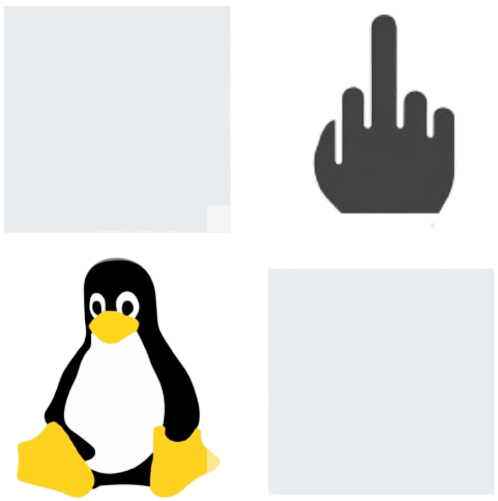
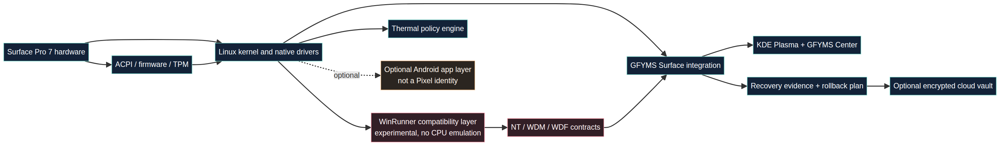
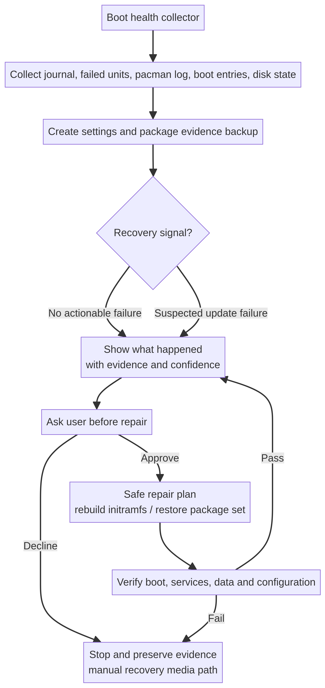

<p align="center">
  
</p>

<h1 align="center">GFYMS Surface Pro 7</h1>

<p align="center"><strong>An Arch-based Linux distribution engineered around the Microsoft Surface Pro 7.</strong></p>

<p align="center">
  <a href="https://github.com/NCOM-Systems/GFYMS-Surface-Pro-7/actions"></a>
  <a href="https://github.com/NCOM-Systems/GFYMS-Surface-Pro-7"></a>
  <a href="https://archlinux.org/"></a>
  <a href="https://www.kernel.org/"></a>
  <a href="https://github.com/NCOM-Systems/GFYMS-Surface-Pro-7/blob/main/LICENSE-GFYMS.txt"></a>
</p>

> **Project status:** active engineering and qualification. The ISO build foundation, native Surface packages, WinRunner compatibility primitives, recovery evidence tooling, and cloud-vault design exist. Full Windows `.sys` execution and complete Surface hardware qualification are not finished.

GFYMS means **Go Fix Your Microsoft Surface**. It began as a practical response to the gaps between owning Surface hardware and getting a first-class Linux experience. The goal is not to repackage Windows or claim Microsoft affiliation. The goal is a reproducible Linux system that makes the Surface Pro 7 observable, supportable, recoverable, and increasingly well integrated.

## Contents

- [What GFYMS is](#what-gfyms-is)
- [Architecture](#architecture)
- [Feature status](#feature-status)
- [Surface Pro 7 hardware focus](#surface-pro-7-hardware-focus)
- [WinRunner compatibility layer](#winrunner-compatibility-layer)
- [Recovery and rollback](#recovery-and-rollback)
- [Thermal and power policy](#thermal-and-power-policy)
- [Optional Android and APK support](#optional-android-and-apk-support)
- [Private cloud vault](#private-cloud-vault)
- [Official payload staging](#official-payload-staging)
- [Build the ISO](#build-the-iso)
- [Repository map](#repository-map)
- [Legal and distribution boundary](#legal-and-distribution-boundary)
- [Roadmap](#roadmap)
- [Contributing](#contributing)

## What GFYMS is

GFYMS is a Surface-specific Arch Linux distribution layer built on normal Linux primitives:

- Linux kernel and native Linux drivers remain responsible for hardware safety.
- GFYMS adds Surface policy, diagnostics, desktop controls, recovery, and hardware qualification.
- WinRunner is an experimental Linux implementation of selected NT/WDM/WDF driver contracts.
- Proprietary Microsoft payloads are not automatically redistributed in the public ISO.
- The project separates verified facts, research observations, and future targets.

GFYMS is **not affiliated with Microsoft**, is not Windows, and does not currently contain the Microsoft Windows kernel.

## Architecture



The system is intentionally hybrid. Mature behavior should become native Linux code; behavior that is difficult to reproduce can be isolated behind a narrowly scoped compatibility contract. That keeps the system debuggable instead of turning the whole OS into an opaque compatibility experiment.

```text
Surface hardware
      |
      +--> Linux kernel, ACPI, PCI, USB, IIO, input, ALSA, power
      |
      +--> GFYMS Surface packages, diagnostics and KDE integration
      |
      +--> Recovery evidence, rollback plans and encrypted cloud snapshots
      |
      +--> WinRunner compatibility layer for qualified driver contracts
```

## Feature status

| Area | Current state | What “done” requires |
|---|---|---|
| Arch-based ISO | Build profile and release workflow exist | Reproducible signed release with hardware qualification report |
| KDE Plasma integration | GFYMS Surface package and controls are in progress | Stable KCM/Plasma UX on a real SP7 |
| IPTS touch and pen | Native Linux path under investigation | Touch, pen, palm rejection, suspend/resume tests |
| Type Cover | Native Linux path under investigation | Keyboard, touchpad, backlight and detach/attach tests |
| IPU4/IPU4P camera | Research and compatibility work | Front, rear and IR camera qualification |
| Intel audio | Surface corpus and native integration work | Mic, speakers, jack, PipeWire and suspend tests |
| WinRunner | PE parsing, relocation, memory, pool, objects, IRP primitives | PnP, WDF, DMA, interrupts, DriverEntry boundary and real driver qualification |
| Recovery | Evidence collector, settings backup and repair-plan foundation | Boot-media recovery UI and tested rollback fixtures |
| Thermal policy | Conservative policy engine foundation | Long-duration thermal/battery validation on real hardware |
| Android/APK | Optional compatibility design only | Explicitly supported app set and hardware-acceleration validation |
| Private cloud | Nextcloud Docker reference deployment | User-hosted server, TLS, restore tests and independent backup |

## Surface Pro 7 hardware focus

GFYMS targets the hardware paths that matter on this device:

- IPTS touchscreen and palm rejection
- Surface Pen pressure, buttons, hover and firmware awareness
- detachable Type Cover, touchpad and keyboard backlight
- Intel IPU4/IPU4P camera paths, including front, rear and IR sensors
- Intel SST, SoundWire and Realtek audio
- Wi-Fi and Bluetooth
- battery, charging, thermal and power-management behavior
- accelerometer, ambient-light sensing and automatic rotation
- USB-C, DisplayPort, docks and external displays
- TPM and firmware inventory/update integration
- optional fingerprint support where Linux hardware support exists
- Surface diagnostics and hardware-in-the-loop qualification

See [`docs/GFYMS-HARDWARE-CONTRACT.md`](./docs/GFYMS-HARDWARE-CONTRACT.md) for acceptance criteria.

## WinRunner compatibility layer

WinRunner is the experimental compatibility environment for selected x86_64 Windows driver contracts. It is intended to run compatible driver machine code directly on the host CPU **without CPU instruction emulation**, but it is not the Microsoft Windows kernel and does not yet execute arbitrary `.sys` files.

Implemented foundations include:

- PE32+ AMD64 validation and section mapping
- supported base relocation processing
- explicit import resolver interface
- bounded virtual memory model
- tagged NT-style pool allocations
- named object namespaces and typed references
- events, handles and waits
- WDM device objects, dispatch tables, IRPs and completion routines

The next qualification layers are pool/MDL/DMA integration, PnP and power state machines, interrupts/DPCs, registry/configuration, WDF/KMDF contracts, and a virtual test driver. A driver is not considered supported because `DriverEntry` returns success; it must survive I/O, removal, suspend/resume, teardown and real hardware tests.

See [`kernel/gfyms-winkernel/README.md`](./kernel/gfyms-winkernel/README.md) and [`docs/GFYMS-NATIVE-WINDOWS-RUNTIME.md`](./docs/GFYMS-NATIVE-WINDOWS-RUNTIME.md).

## Recovery and rollback

GFYMS is being built with a recovery path that explains failures before changing the system.



The current recovery tool is evidence-first:

```bash
gfyms-recovery diagnose --output /var/lib/gfyms/recovery/latest
gfyms-recovery backup --output /var/lib/gfyms/recovery/latest \
  --path /etc/gfyms --path /etc/fstab --path /etc/mkinitcpio.conf
gfyms-recovery plan \
  --diagnosis /var/lib/gfyms/recovery/latest/diagnosis.json \
  --output /var/lib/gfyms/recovery/latest
```

It records failed systemd units, current and previous boot errors, boot entries, disk state, and recent package transactions. It can create a settings backup and a proposed repair plan. It does **not** silently roll back packages, erase data, rewrite the bootloader, or rebuild the initramfs without an explicit future approval path.

The intended user flow is:

1. Detect a boot or update anomaly.
2. Preserve logs, package state, configuration, and a backup manifest.
3. Explain what was observed and how confident the diagnosis is.
4. Ask whether to proceed.
5. Apply only a reviewable repair plan.
6. Verify boot, services, user data, settings and presets.
7. Stop and preserve evidence if verification fails.

A device that cannot boot will require a GFYMS recovery ISO/USB environment. No installed service can repair a machine that never reaches its root filesystem.

## Thermal and power policy

Surface Pro 7 thermal behavior is handled as a policy problem, not by unsafe firmware hacks. The GFYMS thermal engine:

- reads standard Linux thermal zones;
- applies hysteresis to avoid power-profile flapping;
- requests `powerprofilesctl` profiles when available;
- records temperatures and selected policy in `/run/gfyms-thermal/state.json`;
- never writes MSRs, disables thermal protection, or claims to eliminate throttling;
- prefers predictable performance and battery life over short benchmark bursts.

The long-term tuning loop will combine thermal zones, battery discharge, fan/skin temperature where exposed, workload class, and suspend/resume behavior. Any Surface-specific tuning must be validated on real hardware and fall back safely when a sensor or control is unavailable.

## Optional Android and APK support

Android support is a possible optional feature, but a Surface Pro 7 cannot honestly be identified as a Google Pixel or use Pixel-only official drivers. The hardware, firmware, boot chain and sensor topology are different.

The target design is an optional **GFYMS-native x86_64 Android userspace** built from open Android/AOSP sources. It must provide ART, Bionic, Binder, Android framework services, package management and AIDL HAL adapters. It is not Waydroid, Anbox, a virtual machine, a fake Pixel profile, or an ordinary Linux process that can execute an APK without Android's runtime.

F-Droid is the preferred initial application source because it can operate without Google Play Services. The planned integration will install the signed F-Droid client inside the Android subsystem, verify its provenance, and keep its repository metadata and app data separate from the base Arch system. F-Droid cannot run directly on the Linux desktop; it becomes available only after the native Android userspace reaches the package-installation milestone.

Current status:

- Android runtime: architecture and contracts documented, not yet bootable in the ISO;
- F-Droid: planned optional Android app source, not bundled into the base ISO yet;
- native APK compatibility: x86/x86_64 APKs are the initial target; ARM-only APKs are unsupported until a separately approved translation project exists;
- no emulated Pixel identity claim and no promise that Google services, Pixel firmware, or proprietary camera HALs work;
- strict separation from the core boot, Surface driver, desktop and recovery paths.

This should remain opt-in and removable. It must not increase boot risk, consume memory when unused, or become a hard dependency of the Surface desktop.

## Private cloud vault

GFYMS includes a reference design for a user-hosted Nextcloud Docker service with MariaDB and Redis:

- [`cloud/nextcloud/compose.yaml`](./cloud/nextcloud/compose.yaml)
- [`cloud/nextcloud/README.md`](./cloud/nextcloud/README.md)

This is for cold data, selective sync and encrypted recovery snapshots. It is not remote RAM, swap, or a replacement for local boot-critical files. Recovery requires a verified restore and an independent backup target.

## Official payload staging

The public ISO contains a hash-pinned staging mechanism, not an unverified Microsoft binary bundle:

- [`packages/gfyms-surface/runtime/`](./packages/gfyms-surface/runtime/)
- [`docs/MS-API-CLONE.md`](./docs/MS-API-CLONE.md)
- [`docs/MS-API-CLONE-INTEGRATION.md`](./docs/MS-API-CLONE-INTEGRATION.md)

The runtime tool requires exact HTTPS URLs and SHA-256 values, writes atomically, and never executes a downloaded payload. Authenticode verification and Windows installer execution belong in a separate Windows adapter. WinRunner qualification is a separate step again.

## Build the ISO

The build uses ArchISO inside a privileged Arch container in CI or local Docker.

```bash
./tools/build-gfyms-release-local.sh
```

The release workflow publishes split/reassemblable artifacts and verification metadata instead of assuming that one large raw ISO upload will always succeed.

Before calling an ISO release supported, run:

```bash
cargo test --manifest-path kernel/gfyms-winkernel/Cargo.toml
python3 -m py_compile tools/gfyms-api-inspect.py
python3 -m py_compile tools/gfyms-recovery/gfyms-recovery.py
```

Only a real Surface Pro 7 can qualify touch, pen, cameras, audio, Type Cover, suspend/resume, firmware and thermal behavior.

## Repository map

| Path | Purpose |
|---|---|
| [`kernel/`](./kernel/) | Native kernel notes and WinRunner compatibility work |
| [`kernel/gfyms-winkernel/`](./kernel/gfyms-winkernel/) | NT/WDM/WDF contract primitives and PE loader |
| [`packages/gfyms-surface/`](./packages/gfyms-surface/) | Surface package sources, runtime staging, recovery and thermal services |
| [`profiles/`](./profiles/) | ArchISO/OpenFactory image profiles |
| [`tools/gfyms-native-re/`](./tools/gfyms-native-re/) | Driver corpus inventory and ABI research |
| [`tools/gfyms-recovery/`](./tools/gfyms-recovery/) | Recovery evidence and backup tooling |
| [`tools/gfyms-api-inspect.py`](./tools/gfyms-api-inspect.py) | Read-only PE/MSI/.NET artifact inspection |
| [`cloud/nextcloud/`](./cloud/nextcloud/) | Private cloud vault reference deployment |
| [`docs/`](./docs/) | Architecture, qualification, legal and implementation documents |
| [`extracted/`](./extracted/) | Local research corpus; not an automatic redistribution bundle |

## Legal and distribution boundary

GFYMS is independent and is not affiliated with Microsoft. Microsoft, Surface, Windows, Android, Google Pixel and related marks belong to their respective owners.

The extracted Surface MSI corpus is a research and provenance input. Owning a physical device does not automatically grant a public redistribution license for Microsoft drivers, DLLs, EXEs, firmware or Windows components. GFYMS-authored source, derived manifests and native Linux implementations must remain distinguishable from third-party payloads and their licenses.

See [`docs/LEGAL-AND-DISTRIBUTION.md`](./docs/LEGAL-AND-DISTRIBUTION.md).

## Roadmap

1. Complete recovery media with a bootable TUI and tested non-destructive restore flow.
2. Expand WinRunner pool, MDL/DMA, PnP, power, interrupt and WDF contracts.
3. Qualify one small virtual driver before attempting a physical Surface driver.
4. Stabilize IPU4/IPU4P camera and Surface audio paths.
5. Validate thermal policy across sustained CPU, camera, audio and suspend workloads.
6. Add optional APK support only after memory, security and hardware-acceleration tests.
7. Produce signed, reproducible ISO releases with hardware qualification evidence.

## Contributing

Please include:

- hardware model and firmware version;
- kernel and GFYMS package versions;
- exact reproduction steps;
- relevant diagnostic bundle with secrets removed;
- whether the result came from a VM, generic x86 laptop, or real Surface Pro 7;
- a clear distinction between observed behavior and a proposed implementation.

Keep the frustration; turn it into reproducible evidence and a patch.
